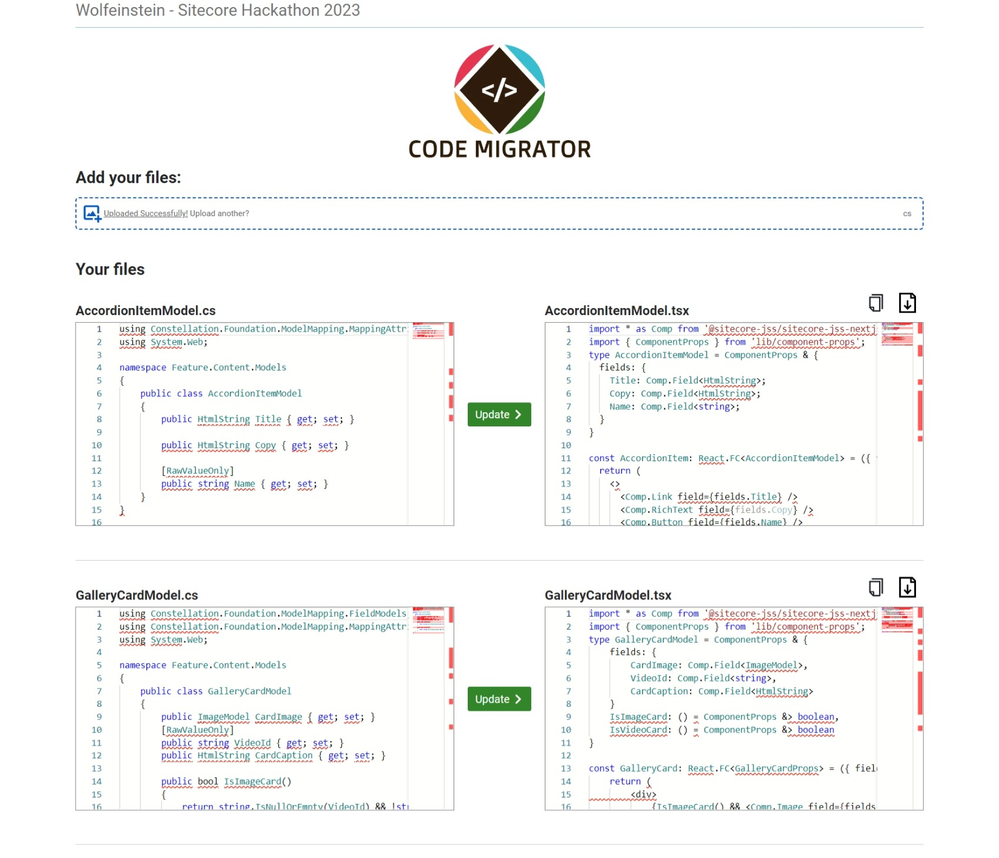
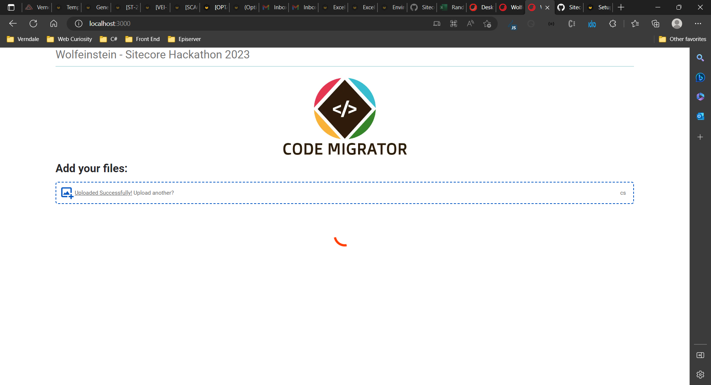
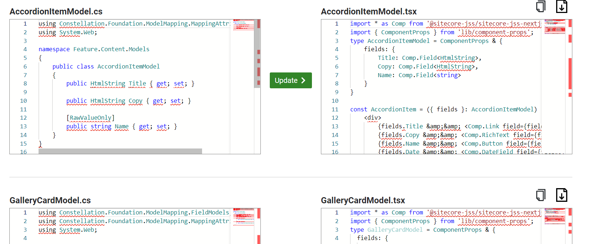
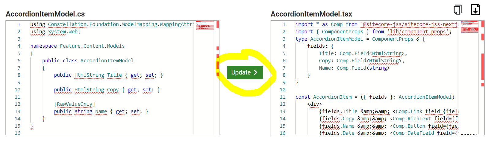
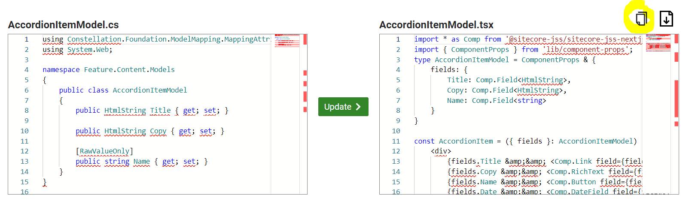
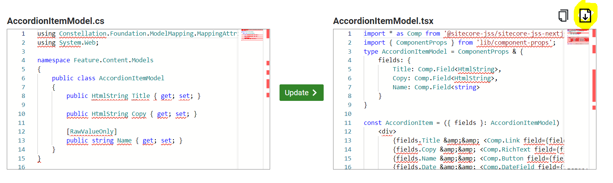

# Sitecore Hackathon 2023

# Hackathon Submission Entry form

## Team name

Wolfeinstein

## Category

Best enhancement to SXA Headless

## Description

Module Purpose

- - A component that can use model templates from c# files and rewrite them to jsx components almost ready to be used.
- What problem was solved (if any)
  - If you have a C# project with several model templates and you do not want to spend a lot of time rewriting those files, you can use our component to get the jsx equivalent components and then download or copy them in your new NextJS project.

## Video link

[https://loom.com/share/43d1d386c2e241319fd07d9264d058c8]()

## Pre-requisites and Dependencies

- Sitecore 10.3.0 rev. 008463 (Setup XM1 Developer Workstation rev. 1.5.0-r11) with SXA
- Sitecore Experience Accelerator 10.3.0 rev. 00074
- Sitecore ExperienceEdge Connector for Sitecore 10.3.0 XM 21.0.0 rev. 0164
- Sitecore Headless Services Server XM 21.0.583
- Node Js 16.16.0
- Package sitecore-jss/sitecore-jss-cli

## Installation instructions

1. Install Sitecore 10.3 for XM Scaled using packages or graphical setup
2. Use the Sitecore installation wizard to install the packages from Sitecore
   - Sitecore Experience Accelerator 10.3.0 rev. 00074
   - Sitecore ExperienceEdge Connector for Sitecore 10.3.0 XM 21.0.0 rev. 0164
   - Sitecore Headless Services Server XM 21.0.583
3. Use the Sitecore installation wizard to install this [package](docs/files/Hackathon-2023-1.0.zip)
4. Install Node Js 16.16.0
5. Install sitecore jss cli using the command
   ```
   npm install -g @sitecore-jss/sitecore-jss-cli
   ```
6. Go to src/CodeMigrator folder and use the command to install all the dependencies
   ```
   npm install
   ```
7. Modify the SITECORE_API_HOST property to your current local sitecore hostname in the [environment file](src/CodeMigrator/.env).
8. If running in windows execute the commands
   ```
   Set ExecutionPolicy Unrestricted
   $env:NODE_TLS_REJECT_UNAUTHORIZED=0
   ```
9. Run the NextJS project using the command
   ```
   jss start:connected
   ```
10. Go to localhost:3000 and you should see the component running

### Configuration

If the application does not work, please re-check that the SITECORE_API_HOST property match your current local sitecore hostname in the [environment file](src/CodeMigrator/.env).

## Usage instructions

To use the component open your browser and go to [http://localhost:3000/](http://localhost:3000/)


When the page loads, you can add one or more of your C# template models to the file uploader and the application will try to convert them to a JSX component. You can use [AccordionItemModel.cs ](docs/files/AccordionItemModel.cs)and [GalleryCardModel.cs ](docs/files/GalleryCardModel.cs)as examples. A loader will appear until the files are processed.



When the application finish processing the files, each one of them will appear as a row showing at the left side the original code, at the right side the migrated jsx component.



On each file you have the option, to change your cs model in the right and update the jsx component in the right by pression the update button.



You can also, copy the content from the jsx component to your clipboard by pressing the copy icon in the top right corner.



Or download the file as a tsx so you can import it to your NextJS project.



## Comments

The component created uses chat gpt behind the scenes but we also parse part of the responses to have a better migration result.
